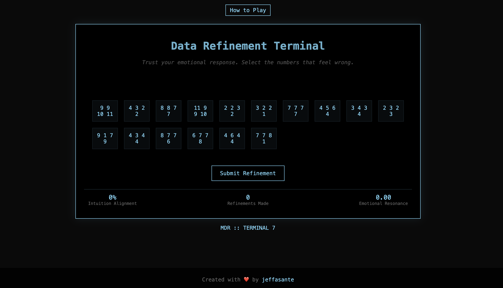

# NumberSense: Emotional Data Refinement Game


> [Play the Game](https://jeffasante.github.io/number-sense/) | [GitHub Repository](https://github.com/jeffasante/number-sense)


A web-based game inspired by the mysterious data refinement work seen in Apple TV+'s "Severance". This project recreates the unsettling experience of selecting numbers based purely on emotional response, without knowing their true meaning.

## Overview

In the TV show "Severance", employees perform the mysterious task of "refining" numbers based purely on how they feel, without understanding what the numbers represent. This project recreates that experience as an interactive web game.

## Features

- **Intuitive Interface**: Clean, retro-terminal aesthetic matching the show's visual style
- **Dynamic Number Generation**: Creates patterns of numbers that may feel "wrong" or "unsettling"
- **Emotional Response System**: Hover effects reveal cryptic messages about number patterns
- **Mysterious Metrics**: Tracks various unclear measurements like "Emotional Resonance" and "Intuition Alignment"
- **Responsive Design**: Works across different screen sizes
- **Minimal Dependencies**: Built with vanilla HTML, CSS, and JavaScript

## Technical Implementation

### Core Components

1. **Number Generation**
   - Uses `generateNumberGroup()` to create both "normal" and potentially "unsettling" number patterns
   - Implements weighted randomization for number distribution

2. **UI Elements**
   - Terminal-style interface with retro aesthetics
   - Interactive grid system for number selection
   - Hover effects with emotional response messages
   - Metrics panel with mysterious calculations

3. **User Interaction**
   - Click-to-select mechanism for number refinement
   - Real-time metric updates
   - Emotional prompt system
   - How-to-play toggle functionality

### Key Features Breakdown

```javascript
// Example of number pattern generation
function generateNumberGroup() {
    let groups = [];
    // Creates mix of "normal" and "unsettling" patterns
    if (Math.random() < 0.3) {
        // Generates intentionally disturbing patterns
        numbers = Array(4).fill().map(() => 
            Math.floor(Math.random() * 9) + 1
        );
    } else {
        // Creates more uniform patterns
        let base = Math.floor(Math.random() * 9) + 1;
        numbers = [base, base, base, base].map(n => 
            n + Math.floor(Math.random() * 3)
        );
    }
    return groups;
}
```

## Setup

1. Clone the repository
2. Open `index.html` in a web browser
3. No build process or dependencies required

## Customization

You can modify the game by adjusting these key elements:

- `emotionalResponses`: Array of hover messages
- `generateNumberGroup()`: Logic for number pattern generation
- CSS variables: Visual styling and animations
- Metrics calculation in `updateMetrics()`

## Contributing

Feel free to contribute to this project by:
1. Forking the repository
2. Creating your feature branch
3. Committing your changes
4. Opening a pull request

## License

This project is open source and available under the MIT License.

## Credits

- Created by [jeffasante](https://github.com/jeffasante)
- Inspired by the Apple TV+ show "Severance"

---

For questions or suggestions, please open an issue on GitHub.